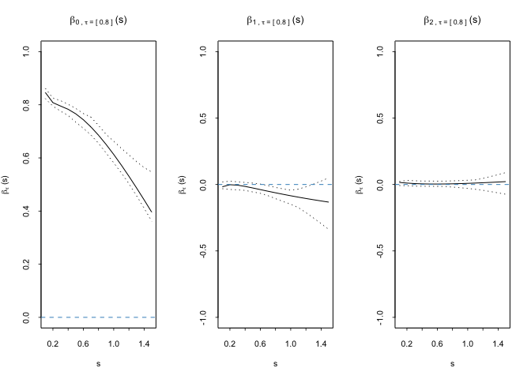
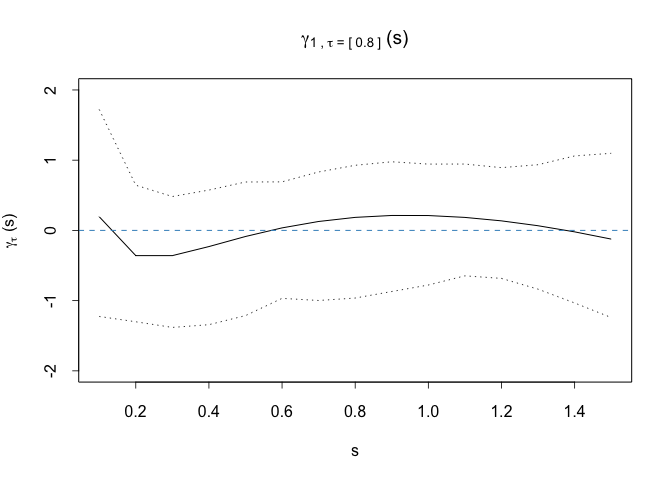

    library(MESS)
    library(dplyr)
    library(survival)
    library(quantreg)
    source("R/function_model_fit.R") #models
    source("R/function_data_analysis.R") #get model results and plots
    source("R/Monotone_ROC.R") #get monotoned ROC curve & AUC

## Introduction

We propose a flexible regression framework to evaluate the prognostic
capability of longitudinal biomarker with survival outcome accounting
for the covariate and biomaker measurement time. Here is an example
using a simulated dataset to estimate the biomarker threshold at a
specified specificity level along with the corresponding sensitivity,
and to construct a covariate- and measurement time-specific ROC curve.

## Read in simulated long and short data

    long.data <- read.csv("Data/reg_data_sim_long.csv")
    short.data <- read.csv("Data/reg_data_sim_short.csv")

    #set parameters
    cutoff.type.basis = "FP"
    sens.type.basis = "FP"
    covariate1 = c("Z", "Zcont")
    covariate2 = c("Z", "Zcont")
    tau = 0.8
    time.window = 1
    nResap = 50

## estimate measurement time-varying coefficients

    model.results = analysis_main(long.data, short.data, cutoff.type.basis, sens.type.basis, covariate1, covariate2, tau, time.window, nResap)

    #output
    model.results$cutoff_plots() 

    model.results$sens_plots()

    model.results$model_results$model.results$cutoff.model

    ## Call:
    ## rq(formula = form, tau = tau, data = data, weights = wt_rsap)
    ## 
    ## Coefficients:
    ##     (Intercept)            logt           sqrtt       sqrtt_inv               Z 
    ##      3.25781626      2.43893147     -4.10516946      1.49808804      0.17779243 
    ##           Zcont          logt:Z      logt:Zcont         sqrtt:Z     sqrtt:Zcont 
    ##     -0.20584834     -0.32217537     -0.17960692      0.08440667      0.30341534 
    ##     sqrtt_inv:Z sqrtt_inv:Zcont 
    ##     -0.33604048     -0.09086832 
    ## 
    ## Degrees of freedom: 1543 total; 1531 residual

    model.results$model_results$model.results$sensitivity.model

    ## [[1]]
    ## 
    ## Call:  glm(formula = form, family = binomial(link = "logit"), data = data, 
    ##     weights = mod.weight)
    ## 
    ## Coefficients:
    ##     (Intercept)             logt            sqrtt        sqrtt_inv  
    ##          -1.336           -3.094            4.177           -1.973  
    ##               Z            Zcont           logt:Z       logt:Zcont  
    ##          11.076            9.550           21.841           11.416  
    ##         sqrtt:Z      sqrtt:Zcont      sqrtt_inv:Z  sqrtt_inv:Zcont  
    ##         -27.148          -16.262           16.284            6.840  
    ## 
    ## Degrees of Freedom: 1395 Total (i.e. Null);  1384 Residual
    ## Null Deviance:       1752 
    ## Residual Deviance: 1731  AIC: 1663

## Conditional ROC curve

    ROC.data = data.frame(vtime = 0.5, Z = 1, Zcont = mean(short.data$Zcont))
    tau.set = seq(0.01, 1, 0.05)

    ROC.results <- ROC.main(my.newdat = ROC.data, long.data, short.data, tau.set, time.window,
                             cutoff.type.basis = "FP", sens.type.basis = "FP",
                             covariate1 = c("Z", "Zcont"), covariate2 = c("Z", "Zcont"),
                             nResap=50)

    #output ROC curve and AUC value
    plot_ROC(ROC.results$ROC.results$ROC, my.add = FALSE, my.col = "black", my.lty = 1)

    ROC.results$ROC.results$AUC

    ## [1] 0.858847
