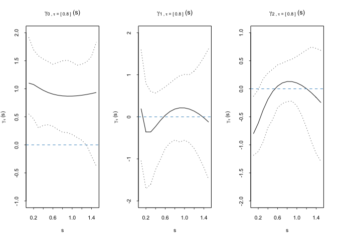

    library(MESS)
    library(dplyr)
    library(survival)
    library(quantreg)
    source("R/function_model_fit.R") #models
    source("R/function_data_analysis.R") #get model results and plots
    source("R/Monotone_ROC.R") #get monotoned ROC curve & AUC

## Introduction

We propose a flexible regression framework to evaluate the prognostic
capability of longitudinal biomarker with survival outcome accounting
for the covariate and biomaker measurement time. Here is an example
using a simulated dataset to estimate the biomarker threshold at a
specified specificity level along with the corresponding sensitivity,
and to construct a covariate- and measurement time-specific ROC curve.

## Read in long and short data

    dat.long <- read.csv("Data/reg_data_sim_long.csv")
    dat.short <- read.csv("Data/reg_data_sim_short.csv")

## Estimate time-varying coefficients

-   dat.long: long format data, each subject may have multiple biomarker
    records
-   dat.short: short format data, each subject only has one record,
    including observed event time, event indicator, covariates (eg. Z,
    Zcont in this example)
-   cutoff.type.basis: type of basis function to estimate biomarker
    threshold, (FP: Fractional polynomial, linear: linear basis)
-   sens.type.basis: type of basis function to estimate sensitivity
    level, (FP: Fractional polynomial, linear: linear basis)
-   covariate1: a vector of covariate names to estimate the biomarker
    threshold
-   covariate2: a vector of covariate names to estimate the sensitivity
    level
-   tau: target specificity level, could be a single value or a set of
    values between 0 and 1
-   time.window: a time window for biomarker evaluation
-   nResap: number of perturbation resampling

<!-- -->

    model.results = analysis_main(dat.long = dat.long, 
                                  dat.short = dat.short, 
                                  cutoff.type.basis = "FP", 
                                  sens.type.basis = "FP", 
                                  covariate1 = c("Z", "Zcont"), 
                                  covariate2 = c("Z", "Zcont"), 
                                  tau = 0.8, 
                                  time.window = 1,
                                  nResap = 50)

    #output
    par(mfrow=c(1,3))
    model.results$cutoff_plots() 

    model.results$sens_plots()

## Conditional ROC curve

    ROC.results <- ROC.main(my.newdat = data.frame(vtime = 0.5, Z = 1, Zcont = 0.25),
                            dat.long = dat.long,
                            dat.short = dat.short, 
                            tau = seq(0.01, 1, 0.05), 
                            time.window = 1,
                            cutoff.type.basis = "FP",
                            sens.type.basis = "FP",
                            covariate1 = c("Z", "Zcont"), 
                            covariate2 = c("Z", "Zcont"),
                            nResap=50)

    #output ROC curve and AUC value
    plot_ROC(ROC.results$ROC.results$ROC, my.add = FALSE, my.col = "black", my.lty = 1)

    ROC.results$ROC.results$AUC

    ## [1] 0.8568154
